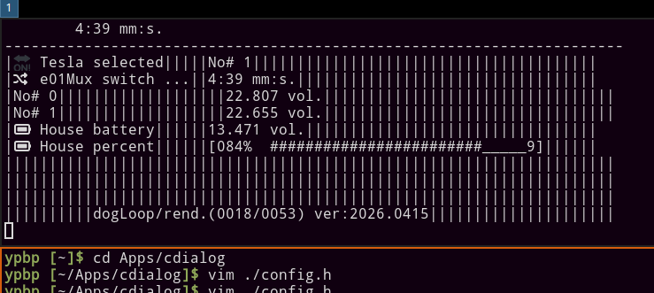

# ccanvash.bin


## dependecies

 - at postmarketOs arm64

gcc, build-base, ncurses-dev, mosquitto-dev


## asBar start

Starting it as i3bar. Cut out from my .config/sway/config file 

```config
status_command /home/user/Apps/cdialog/ccanvash.bin -asBar -row=1 -col=100
```

## config.h

File `config.h` is a main config file use in building / compiling process.
What you compile depend on target aplication you whant to build.
Current builders have sufix `...BuildN.sh` where N is a number / version / variant.


## modules / files

There is many files in this project. Loking at them in sens of files with extension of *.c . Many of them represent a functionality / work. Example can be file `dogh.c`. It's set of functions and variables alowing to play with watchDog's concept. files, mqtt, cmd, time, ...


### mqttView2

On event / message published at mqtt viewer. It use ccanvas to have `terminal buffor` to draw blocks of text and data. This one now use `config.h` to build it subscription list. How to source / postprocess data is in same place.


To run it:
```bash
./mqttView2.test.bin -chFill=_ -col=60 -row=10
```

Current a.k.a. sceenshot of app running:



### TODO / FIX / KNOWN bugs

[ ] ccanvas don't do correct unicode characters :(


---

If you see that this makes sense [ send me a ☕ ](https://ko-fi.com/B0B0DFYGS) | [Master repository](https://github.com/yOyOeK1/oiyshTerminal) | [About SvOiysh](https://www.youtube.com/@svoiysh)
